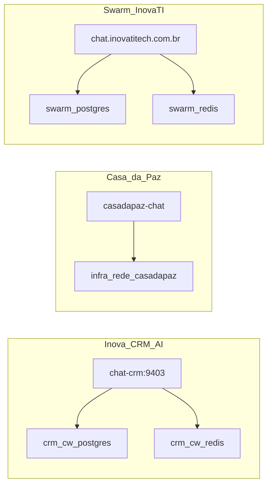

# Instâncias Chatwoot na VPS — inventário e governança

**Objetivo:** uma instância Chatwoot **por produto**, com Postgres/Redis/domínio/bind próprios.  
**Proibido:** compartilhar Redis ou Postgres entre produtos.

Inventário vivo: `bash infrastructure/scripts/audit-chatwoot-instances.sh`

---

## Inventário canônico

| Projeto                    | Domínio                             | Bind host                    | Stack / path                     | Compose project / serviços                                                                       |
| -------------------------- | ----------------------------------- | ---------------------------- | -------------------------------- | ------------------------------------------------------------------------------------------------ |
| **Inova CRM AI**           | `chat-crm.inovatitech.com.br`       | `127.0.0.1:9403`             | `/opt/inova-crm-ai/chatwoot`     | `crm-chatwoot` → `crm_chatwoot_rails`, `crm_chatwoot_sidekiq`, `crm_cw_postgres`, `crm_cw_redis` |
| **Casa da Paz**            | `casadapaz-chat.inovatitech.com.br` | deve ser `127.0.0.1:<porta>` | `/home/gestaoti/casadapaz/infra` | compose `infra` → `infra-chatwoot-1`, `infra-chatwoot-sidekiq-1`                                 |
| **Swarm InovaTI** (legado) | `chat.inovatitech.com.br`           | rede Swarm + Tunnel          | Docker Swarm                     | `chatwoot-admin_chatwoot-admin`, `chatwoot-sidekiq_chatwoot-sidekiq`                             |



---

## Convenção de naming

| Artefato         | Padrão                                   | Exemplo CRM                   |
| ---------------- | ---------------------------------------- | ----------------------------- |
| Compose project  | `{produto}-chatwoot`                     | `crm-chatwoot`                |
| Rails / Sidekiq  | `{produto}_chatwoot_rails\|sidekiq`      | `crm_chatwoot_rails`          |
| Postgres / Redis | `{produto}_cw_postgres\|redis`           | `crm_cw_postgres`             |
| Domínio          | `chat-{produto}.…` ou `{produto}-chat.…` | `chat-crm.inovatitech.com.br` |
| DB name          | `chatwoot_{produto}`                     | `chatwoot_crm`                |

Swarm `chat.inovatitech.com.br` permanece documentado como **legado** até o dono decidir rename/migração.

---

## Padrão de bind (obrigatório)

- UI Chatwoot no host: **sempre** `127.0.0.1:<porta>` + **Cloudflare Tunnel**.
- **Nunca** publicar `0.0.0.0:<porta>` para a UI.

### Casa da Paz — bind

Estado **2026-08-03:** `infra-chatwoot-1` em `127.0.0.1:3001` (OK). Se voltar `0.0.0.0`, runbook (path `casadapaz`, fora deste repo):

1. Publish → `127.0.0.1:3001:3000` no compose messaging.
2. Tunnel `casadapaz-chat.inovatitech.com.br` → `http://127.0.0.1:3001`.
3. `docker compose … up -d --force-recreate` do serviço chatwoot.
4. `bash /opt/inova-crm-ai/infrastructure/scripts/audit-chatwoot-instances.sh` → `deviations=0`.

---

## Isolamento CRM (este repo)

- Redes: `cw` (interna) + `inova-crm` (external, só API/workers CRM).
- Imagem pinada: `CHATWOOT_IMAGE` (default `chatwoot/chatwoot:v4.8.0`).
- Limites: `pids_limit: 512`, `mem_limit` 768M (rails) / 512M (sidekiq) — evita 500 por `can't fork`.
- Audit dedicado: `bash chatwoot/scripts/audit-crm-chatwoot.sh`
- Se rails PID ≥ **80%** do limite → recreate imediato (ver § CRM PID).
- Docs: [integracao-chatwoot.md](../integracao-chatwoot.md), [chatwoot/README.md](../../chatwoot/README.md)

### CRM PID — snapshot e recreate

| Data (UTC)     | rails PIDs         | sidekiq | Health rails | Ação                    |
| -------------- | ------------------ | ------- | ------------ | ----------------------- |
| 2026-08-03 pré | **512/512** (100%) | ~22/512 | unhealthy    | recreate                |
| 2026-08-03 pós | **17/512** (~3%)   | ~21/512 | healthy      | `AUDIT_CRM_CHATWOOT_OK` |

```bash
cd /opt/inova-crm-ai/chatwoot
docker compose -f docker-compose.yml -f docker-compose.vps.yml \
  up -d --force-recreate --no-deps rails sidekiq
bash /opt/inova-crm-ai/chatwoot/scripts/audit-crm-chatwoot.sh
curl -sS -o /dev/null -w 'chatwoot %{http_code}\n' http://127.0.0.1:9403/
```

---

## Pacote de decisão — Swarm Inova-TI (`chat.inovatitech.com.br`)

**Proibido:** `docker service scale …=0` sem autorização **explícita** do dono Inova-TI.  
**Aplicado 2026-08-19:** scale **0/0** (operador CRM) — stack estava em loop Rejected (vxlan); CRM `chat-crm` intacto.

### Snapshot 2026-08-19 (atual)

| Service                             | Replicas | Estado            |
| ----------------------------------- | -------- | ----------------- |
| `chatwoot-admin_chatwoot-admin`     | **0/0**  | Pausado (scale 0) |
| `chatwoot-sidekiq_chatwoot-sidekiq` | **0/0**  | Pausado (scale 0) |

Antes: `0/1` com Rejected — `network sandbox join failed` / vxlan `10.0.1.0/24: file exists`.

### Snapshot 2026-08-03 (histórico)

| Service                             | Replicas | Image                      | Estado task                       |
| ----------------------------------- | -------- | -------------------------- | --------------------------------- |
| `chatwoot-admin_chatwoot-admin`     | **1/1**  | `chatwoot/chatwoot:v4.8.0` | Running ~8d (PIDs baixos no task) |
| `chatwoot-sidekiq_chatwoot-sidekiq` | **1/1**  | `chatwoot/chatwoot:v4.8.0` | Running ~8d                       |

Histórico: tasks anteriores com **Exit 137** (OOM/kill) — stack instável sob pressão de RAM da VPS compartilhada.

### Pré-requisitos antes de qualquer mudança

1. Quem ainda usa `https://chat.inovatitech.com.br`? (lista de produtos/clientes)
2. Cloudflare Tunnel / DNS: hostname legado aponta para Swarm — migrar ou desligar?
3. Backup / export se houver dados vivos no Postgres Swarm
4. Rotação de secrets (ver § Segurança) **antes** de expor de novo
5. Corrigir overlay Swarm (vxlan) **antes** de voltar a 1/1 — runbook: [`swarm-vxlan-chatwoot-fix.md`](./swarm-vxlan-chatwoot-fix.md)

### Checklist dono Inova-TI

| Decisão         | Marcar         | Efeito                               |
| --------------- | -------------- | ------------------------------------ |
| Manter ativo    | [ ]            | Continua 1/1; CRM não toca           |
| Scale 0 (pause) | [x] 2026-08-19 | Pausado; Tunnel legado pode 502      |
| Remover stack   | [ ]            | Só após backup + confirmação escrita |

### Comandos (comentados — só após confirmação)

```bash
# Inventário
# docker service ls | grep -i chatwoot
# docker service ps chatwoot-admin_chatwoot-admin --no-trunc | head
# docker service ps chatwoot-sidekiq_chatwoot-sidekiq --no-trunc | head

# Scale 0 (aplicado 2026-08-19)
# docker service scale chatwoot-admin_chatwoot-admin=0 chatwoot-sidekiq_chatwoot-sidekiq=0

# Voltar 1/1 (só após fix vxlan + dono Inova-TI)
# docker service scale chatwoot-admin_chatwoot-admin=1 chatwoot-sidekiq_chatwoot-sidekiq=1
```

---

## Checklist de ciclo de vida (não automático)

Antes de pausar ou remover uma instância, o **dono do produto** confirma:

| Instância                       | Manter ativo | Scale 0 / pause | Remover |
| ------------------------------- | ------------ | --------------- | ------- |
| CRM `chat-crm`                  | [x]          | [ ]             | [ ]     |
| Casa da Paz `casadapaz-chat`    | [ ]          | [ ]             | [ ]     |
| Swarm `chat.inovatitech.com.br` | [ ]          | [x] 2026-08-19  | [ ]     |

### Comandos de referência (só após confirmação explícita)

```bash
# Swarm — ver § Pacote de decisão (scale comentado)

# Casa da Paz — pause containers (path do compose casadapaz)
# cd /home/gestaoti/casadapaz/infra && docker compose -f docker-compose.prod.yml -f docker-compose.prod.messaging.yml stop chatwoot chatwoot-sidekiq

# CRM — recreate com limites (após sync do repo)
# cd /opt/inova-crm-ai/chatwoot
# docker compose -f docker-compose.yml -f docker-compose.vps.yml up -d --force-recreate --no-deps rails sidekiq
```

---

## Segurança (Swarm)

O service Swarm já foi observado com secrets/placeholders fracos em variáveis de ambiente. **Remediação** (rotação `SECRET_KEY_BASE`, senhas Postgres/SMTP) é responsabilidade do dono da stack Swarm — não misturar com o `.env` do CRM.

---

## Relacionados

- [ports.md](../ports.md) — bloco `9400–9419` (CRM) · SSH VPS `:65022`
- [vps-ssh.md](./vps-ssh.md) — acesso SSH
- [swarm-vxlan-chatwoot-fix.md](./swarm-vxlan-chatwoot-fix.md) — voltar Swarm Chatwoot a 1/1
- [vps-ram-hardening.md](./vps-ram-hardening.md) — pause de sidekiq em rebuilds
- [webhook-signing.md](../webhook-signing.md) — HMAC CRM ↔ n8n
