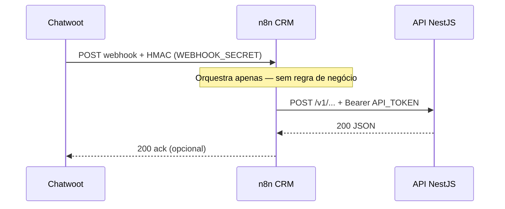

# Webhook Signing — HMAC `X-Inova-Signature`

**Versão:** 0.1 (Fase 2–3)  
**Escopo:** verificação de webhooks Chatwoot → n8n/API e chamadas assinadas ao backend NestJS.

---

## Propósito

Garantir autenticidade e integridade de payloads webhook usando **HMAC-SHA256** compartilhado via `WEBHOOK_SECRET` (mesmo valor em Chatwoot, n8n env e API).

---

## Cabeçalho

| Header              | Valor                                   |
| ------------------- | --------------------------------------- |
| `X-Inova-Signature` | `sha256=<hex_digest>`                   |
| `X-Inova-Timestamp` | Unix epoch (segundos) — **recomendado** |
| `Content-Type`      | `application/json`                      |

O prefixo `sha256=` segue o padrão GitHub/Stripe para parsing unívoco.

---

## Algoritmo

1. Serializar o body **raw** (bytes exatos recebidos — sem reformatar JSON).
2. Montar string de assinatura:

```
v1:<timestamp>:<raw_body>
```

Se `X-Inova-Timestamp` não for enviado, usar apenas o raw body (modo legado Chatwoot):

```
<raw_body>
```

3. Calcular HMAC-SHA256 com `WEBHOOK_SECRET` como chave.
4. Comparar com `X-Inova-Signature` usando **timing-safe** compare (`crypto.timingSafeEqual`).

---

## Exemplos

### Node.js (API NestJS — guard/middleware)

```typescript
import { createHmac, timingSafeEqual } from 'node:crypto';

function verifyInovaSignature(
  rawBody: Buffer,
  signatureHeader: string | undefined,
  timestampHeader: string | undefined,
  secret: string,
  maxSkewSeconds = 300,
): boolean {
  if (!signatureHeader?.startsWith('sha256=') || !secret) return false;

  const expectedHex = signatureHeader.slice('sha256='.length);
  const timestamp = timestampHeader ? Number(timestampHeader) : null;

  if (timestamp !== null) {
    const now = Math.floor(Date.now() / 1000);
    if (Math.abs(now - timestamp) > maxSkewSeconds) return false;
  }

  const payload =
    timestamp !== null && !Number.isNaN(timestamp)
      ? `v1:${timestamp}:${rawBody.toString('utf8')}`
      : rawBody.toString('utf8');

  const digest = createHmac('sha256', secret).update(payload).digest('hex');

  try {
    return timingSafeEqual(Buffer.from(digest, 'hex'), Buffer.from(expectedHex, 'hex'));
  } catch {
    return false;
  }
}
```

### PowerShell (teste manual)

```powershell
$secret = "change_me_webhook_secret"
$body = '{"event":"message_created"}'
$timestamp = [int][double]::Parse((Get-Date -UFormat %s))
$payload = "v1:${timestamp}:${body}"
$hmac = New-Object System.Security.Cryptography.HMACSHA256
$hmac.Key = [Text.Encoding]::UTF8.GetBytes($secret)
$hex = -join ($hmac.ComputeHash([Text.Encoding]::UTF8.GetBytes($payload)) | ForEach-Object { $_.ToString("x2") })
Write-Host "X-Inova-Timestamp: $timestamp"
Write-Host "X-Inova-Signature: sha256=$hex"
```

### curl (smoke com timestamp)

```bash
BODY='{"event":"message_created"}'
TS=$(date +%s)
SIG=$(printf 'v1:%s:%s' "$TS" "$BODY" | openssl dgst -sha256 -hmac "$WEBHOOK_SECRET" | awk '{print $2}')
curl -X POST "https://api-crm.inovatitech.com.br/v1/webhooks/chatwoot" \
  -H "Content-Type: application/json" \
  -H "X-Inova-Timestamp: $TS" \
  -H "X-Inova-Signature: sha256=$SIG" \
  -d "$BODY"
```

---

## Fluxos no CRM



| Origem   | Autenticação para destino | Segredo                 |
| -------- | ------------------------- | ----------------------- |
| Chatwoot | n8n webhook               | `WEBHOOK_SECRET` (HMAC) |
| n8n      | API NestJS                | `API_TOKEN` (Bearer)    |
| Worker   | API NestJS                | `API_TOKEN` (Bearer)    |
| Cron/ext | API direto                | HMAC ou `API_TOKEN`     |

n8n **não** recalcula HMAC ao encaminhar — usa `Authorization: Bearer` conforme [integracao-n8n.md](./integracao-n8n.md). A API valida HMAC em endpoints expostos diretamente a webhooks externos.

---

## Chatwoot

No painel Chatwoot (Integrations → Webhooks), configure a URL do n8n e o mesmo `WEBHOOK_SECRET` do `.env`. O Chatwoot envia header de assinatura nativo (`X-Chatwoot-Signature`); o n8n pode repassar o body à API com Bearer. Para validação unificada na API, mapear ou normalizar para `X-Inova-Signature` no backend quando o source for Chatwoot.

---

## Rotação de segredo

1. Gerar novo `WEBHOOK_SECRET`.
2. Atualizar Chatwoot, `infrastructure/.env`, `chatwoot/.env` e API.
3. Reiniciar serviços afetados.
4. Smoke com curl acima.

---

## Referências

- [integracao-chatwoot.md](./integracao-chatwoot.md)
- [integracao-n8n.md](./integracao-n8n.md)
- [seguranca-lgpd.md](./seguranca-lgpd.md)
